# Enterprise Attendance Management System
## Security-First Architecture with MERN, LangGraph Agentic RAG, MongoDB Vector Search, Groq, and Redis

---

## Executive Summary

The Enterprise Attendance Management System is a production-grade workforce attendance, policy governance, and exception adjudication platform. Designed following ISO/IEC 27001 and OWASP ASVS (Application Security Verification Standard) guidelines, the system pairs deterministic time-accounting rules with an autonomous LangGraph agentic validation graph for automated policy interpretation and attendance exception review.

The platform is structured into two independent frontend applications and a unified backend service:
1. **Employee Self-Service Portal**: Provides biometric-style daily check-in/out terminals, real-time working hour calculations, leave balance tracking, document uploads, and self-service late explanation workflows.
2. **HR Operations and Security Console**: Provides executive workforce intelligence, real-time presence telemetry, employee directory lifecycle management, leave approvals, exception adjudications with LangGraph AI advisory scores, cryptographic audit log inspection, and Redis cache controls.
3. **Enterprise Express API Gateway**: Secure microservice backend handling authentication, rate limiting, MongoDB Atlas persistence, GridFS storage, Upstash Redis caching, and Groq/HuggingFace AI inference.

---

## Live Production Deployments

| Component | Target URL | Hosting Platform |
| :--- | :--- | :--- |
| **Employee Self-Service Portal** | [https://inner-eye-attendance-system-fronten-iota.vercel.app](https://inner-eye-attendance-system-fronten-iota.vercel.app) | Vercel Edge Network |
| **HR Administration Console** | [https://inner-eye-attendance-system-hr-dash.vercel.app](https://inner-eye-attendance-system-hr-dash.vercel.app) | Vercel Edge Network |
| **Enterprise Backend API Gateway** | [https://inner-eye-attendance-system.onrender.com](https://inner-eye-attendance-system.onrender.com) | Render Web Service (Node 20 LTS) |

### Pre-Configured Test Credentials

| Role | Username / Email | Password | Scope & Permissions |
| :--- | :--- | :--- | :--- |
| **HR Administrator** | `hr.admin@company.local` | `AdminSecurePass123!` | Full HR console, exception reviews, policy management, audit logs, Redis cache controls |
| **Active Employee** | `aarav.sharma@company.local` | `EmployeePass123!` | Check-in/out, attendance ledger, leave balances, late reasons, AI policy assistant |
| **Secondary Employee** | `priya.patel@company.local` | `EmployeePass123!` | Standard employee access for multi-user testing |

---

## Complete System Architectural Diagrams

The architectural diagrams below are structured into seven distinct architectural views providing complete structural, behavioral, data, and security visibility.

```
+-----------------------------------------------------------------------------------+
|                            ARCHITECTURE DIAGRAM INDEX                             |
+-----------------------------------------------------------------------------------+
|  Section A: Requirements & Actors (System Context & Use Case)                     |
|  Section B: Data Flow Diagrams (DFD Level 0, Level 1, Level 2)                    |
|  Section C: Data & Software Design (Entity-Relationship, Class, Component)        |
|  Section D: Application & Deployment Architecture (System & Cloud Topology)       |
|  Section E: Behavioral Models & Workflows (Activity, State, Sequence Diagrams)    |
|  Section F: AI & Intelligence Architecture (LangGraph RAG & Digital Twin)         |
|  Section G: Security Architecture & Cryptographic Governance                      |
+-----------------------------------------------------------------------------------+
```

---

### Section A: Requirements & Actors

#### 1. System Context Diagram

The System Context Diagram illustrates the boundary of the Enterprise Attendance Management System, identifying all primary human actors and external integration boundaries.

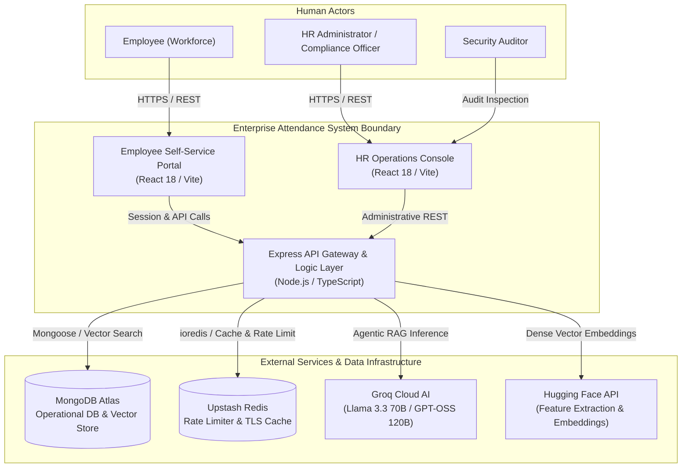

---

#### 2. Comprehensive Use Case Diagram

Defines functional capabilities categorized by actor role across authentication, time tracking, leave, policy enforcement, and administrative governance.

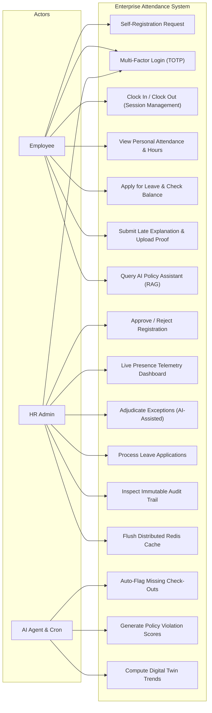

---

### Section B: Data Flow Diagrams (DFD)

#### 3. DFD Level 0 (Context-Level DFD)

Illustrates the single system transformation process, showing environmental inputs and authoritative data outputs.

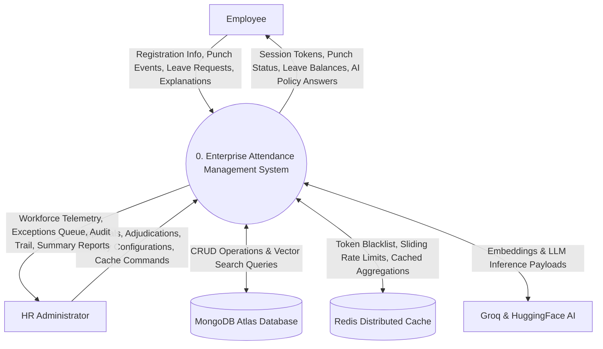

---

#### 4. DFD Level 1 (Major Subsystem Processes)

Decomposes the core system into seven distinct operational subsystems.

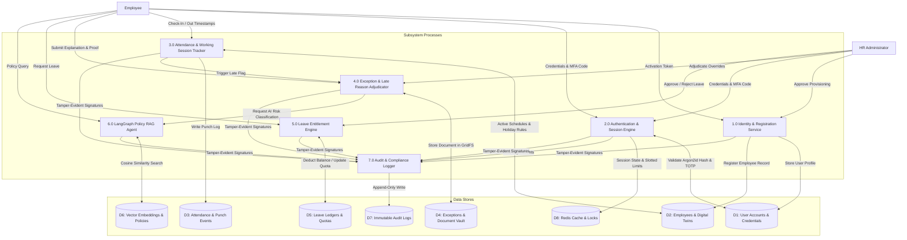

---

#### 5. DFD Level 2 (Registration & Attendance Processing Pipeline)

Detailed data flow of employee provisioning, daily punch calculations, and exception handling.

```mermaid
flowchart TD
    subgraph RegistrationFlow [2.1 Employee Provisioning Flow]
        R1[Submit Registration Form] --> R2{Validate Corporate Email}
        R2 -->|Valid| R3[Create INACTIVE Employee Record]
        R3 --> R4[Dispatch HR Notification]
        R4 --> R5{HR Identity Verification}
        R5 -->|Approved| R6[Generate One-Time Activation Link]
        R5 -->|Rejected| R7[Mark REJECTED with Reason]
        R6 --> R8[Employee Sets Password & TOTP MFA]
        R8 --> R9[Activate Account to ACTIVE]
    end

    subgraph AttendanceFlow [2.2 Attendance Time-Accounting Flow]
        A1[Punch Event Received] --> A2{Token Verified?}
        A2 -->|No| A3[Return 401 Unauthorized]
        A2 -->|Yes| A4[Fetch Assigned Work Schedule]
        A4 --> A5{Shift Type & Grace Period Check}
        A5 -->|Within 15 Min Grace| A6[Mark PRESENT - Normal]
        A5 -->|Beyond Grace Period| A7[Mark LATE - Flag Exception]
        A5 -->|Half Day Rule Met| A8[Mark HALF_DAY]
        A6 & A7 & A8 --> A9[Compute Net Working Hours & Break Deductions]
        A9 --> A10[Save Immutable Attendance Record]
        A10 --> A11[Invalidate Redis User Dashboard Cache]
    end
```

---

### Section C: Data & Software Design

#### 6. Entity Relationship Diagram (ERD)

Defines the relational and document models implemented within MongoDB Atlas.

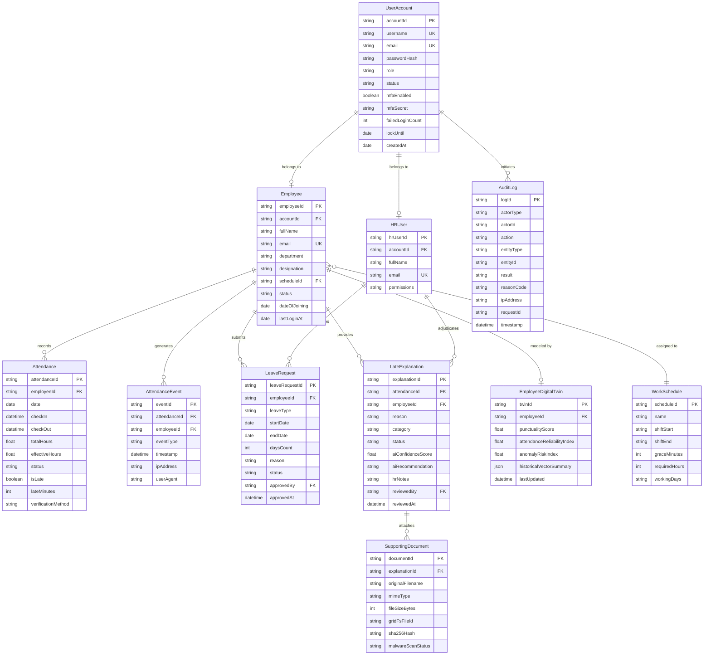

---

#### 7. Class & Software Architecture Diagram

Represents the backend Domain-Driven Design (DDD) controller and service abstraction hierarchy.

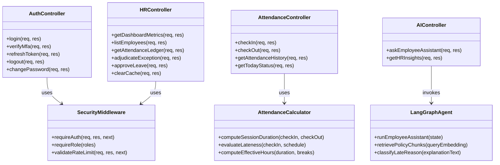

---

#### 8. Component Architecture Diagram

Illustrates software module packaging and communication boundaries across the full MERN application.

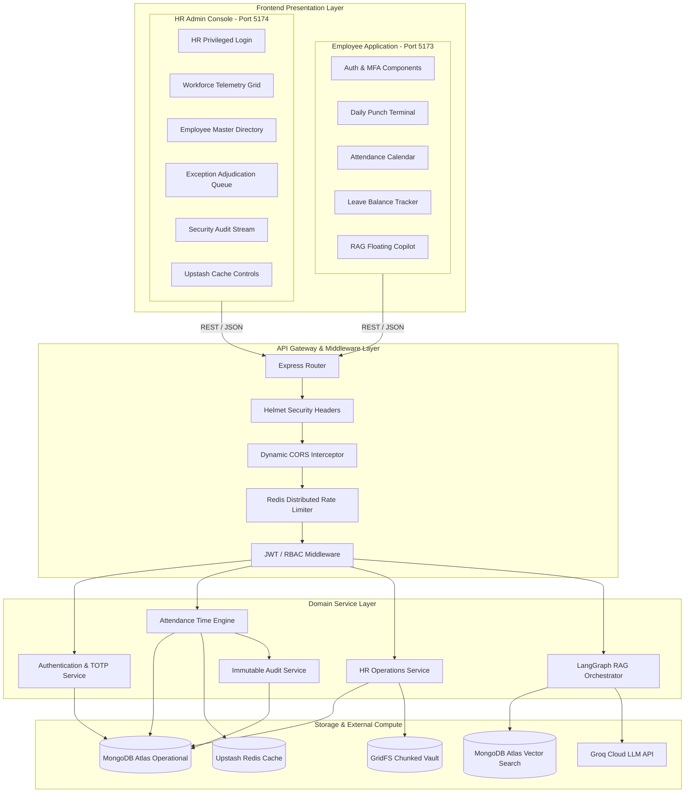

---

### Section D: Application Architecture & Deployment

#### 9. End-to-End System Architecture Diagram

```mermaid
flowchart TB
    subgraph UserLayer [End Users]
        U1["Employees (Any Device)"]
        U2["HR Managers & Officers"]
    end

    subgraph FrontendLayer [Edge Presentation Tier (Vercel CDN)]
        F1["Employee Portal SPA<br/>Vite / React 18 / Tailwind"]
        F2["HR Dashboard SPA<br/>Vite / React 18 / Recharts"]
    end

    subgraph GatewayLayer [API Gateway Tier (Render Linux)]
        GW["Express.js Reverse Proxy & Gateway"]
        MW1["CORS Whitelist Validator"]
        MW2["Sliding-Window Rate Limiter"]
        MW3["OWASP Helmet & Sanitize"]
        MW4["JWT Access Token Guard"]
    end

    subgraph CoreApplicationLayer [Micro-Domain Services]
        S1["Identity & MFA Service"]
        S2["Time-Accounting Engine"]
        S3["Exception Management"]
        S4["Leave Calculation Engine"]
        S5["Compliance Audit Logger"]
    end

    subgraph AgenticAILayer [Agentic RAG Engine]
        LG["LangGraph State Machine Graph"]
        EMB["Hugging Face MiniLM Embeddings"]
        GROQ_INF["Groq Llama 3.3 70B Fast Engine"]
    end

    subgraph StorageLayer [Distributed Data Tier]
        M1[("MongoDB Atlas<br/>Master Documents")]
        M2[("MongoDB Atlas<br/>Vector Search Index")]
        M3[("GridFS<br/>Encrypted Blob Storage")]
        R1[("Upstash Redis<br/>TLS Key-Value Store")]
    end

    U1 -->|HTTPS| F1
    U2 -->|HTTPS| F2
    F1 & F2 -->|REST APIs| GW

    GW --> MW1 --> MW2 --> MW3 --> MW4
    MW4 --> S1 & S2 & S3 & S4 & S5

    S1 <--> M1
    S2 <--> M1
    S2 <--> R1
    S3 <--> M1
    S3 <--> M3
    S3 --> LG
    S4 <--> M1
    S5 --> M1

    LG <--> EMB
    LG <--> M2
    LG <--> GROQ_INF
```

---

#### 10. Infrastructure Deployment Diagram

Illustrates physical cloud hosting topology, TLS encryption, and secure cross-cloud networking.

```mermaid
flowchart TB
    subgraph CloudVercel [Vercel Global Edge Network]
        V1["Vercel Edge Node (iad1)"]
        V1_FE["inner-eye-attendance-system-fronten-iota.vercel.app"]
        V1_HR["inner-eye-attendance-system-hr-dash.vercel.app"]
    end

    subgraph CloudRender [Render Cloud Platform - US East]
        R_SVC["Web Service Instance (Node.js 20 LTS)"]
        R_APP["inner-eye-attendance-system.onrender.com"]
        R_ENV["Environment Secret Vault"]
    end

    subgraph CloudMongo [MongoDB Atlas Cloud - AWS us-east-1]
        M_INST["Replica Set Cluster (M0 / Production)"]
        M_DATA["Operational Database: 'InnerEye'"]
        M_VEC["Vector Search Engine: 'default'"]
        M_BLOB["GridFS Buckets: 'documents.files'"]
    end

    subgraph CloudUpstash [Upstash Serverless Platform]
        UP_REDIS["Redis TLS Endpoint: epic-llama-203106.upstash.io:6379"]
    end

    subgraph CloudAIProviders [AI Cloud Compute Providers]
        GROQ_API["Groq Cloud LPU Inference API"]
        HF_API["Hugging Face Inference Gateway"]
    end

    V1_FE & V1_HR -->|TLS 1.3 / HTTPS| R_APP
    R_APP -->|Encrypted MongoDB Wire Protocol (TLS)| M_INST
    R_APP -->|TLS / rediss://| UP_REDIS
    R_APP -->|HTTPS REST| GROQ_API
    R_APP -->|HTTPS REST| HF_API
```

---

### Section E: Behavioral Models & Workflows

#### 11. Attendance Business Process Activity Diagram

Detailed decision flow for employee arrival, punctuality checks, grace calculations, and exception management.

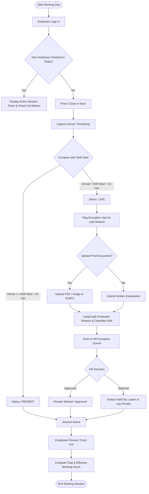

---

#### 12. Attendance Lifecycle State Transition Diagram

State machine governing attendance daily records and exception adjudication transitions.

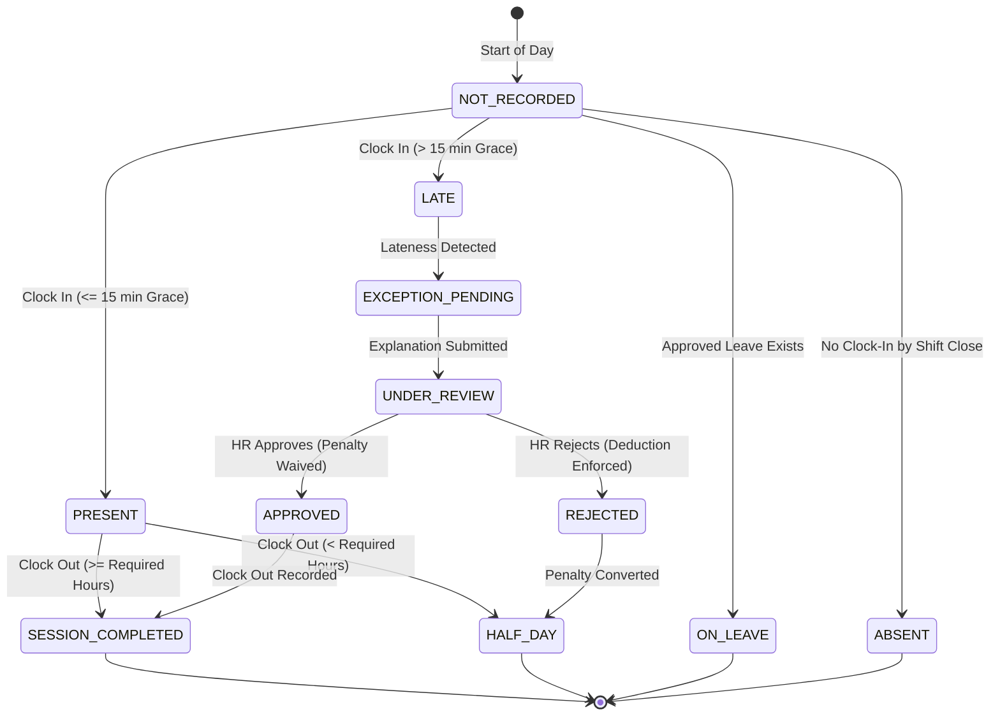

---

#### 13. Sequence Diagrams

##### 13A. Employee Registration & Identity Provisioning Flow

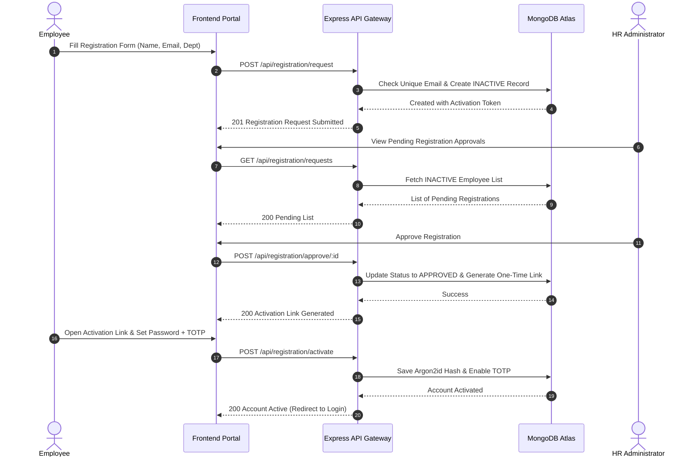

---

##### 13B. Multi-Factor Authentication & JWT Token Exchange

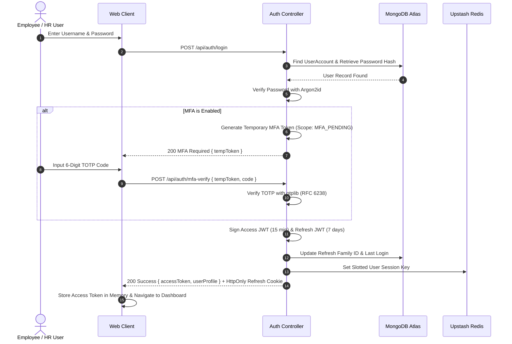

---

##### 13C. Late Exception Review & Autonomous AI Policy Adjudication

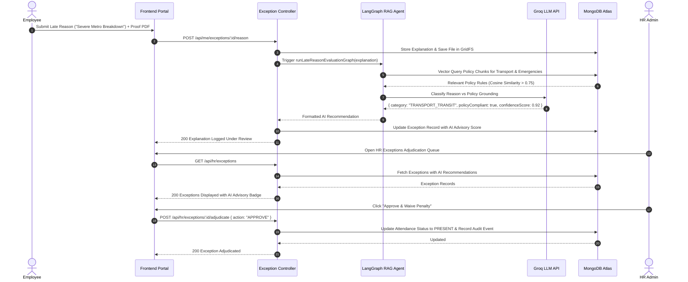

---

### Section F: AI & Intelligence Architecture

#### 14. LangGraph Multi-Node RAG Policy Pipeline

Autonomous state graph pipeline executing intent classification, dense retrieval, policy grading, and deterministic synthesis.

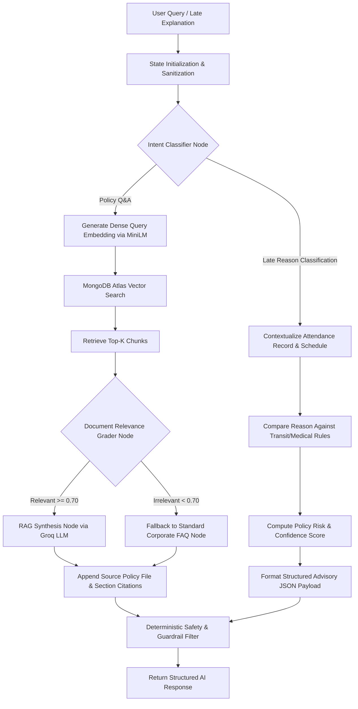

---

#### 15. Employee Digital Twin Architecture

Predictive modeling engine tracking employee attendance patterns, punctuality drift, and burnout risk metrics.

```mermaid
flowchart LR
    subgraph DataSources [Raw Telemetry Ingestion]
        D_ATT["Daily Punch Times<br/>(90-Day Sliding Window)"]
        D_LATE["Late Occurrences & Reasons"]
        D_LEAVE["Leave Patterns & Frequency"]
        D_HOURS["Net Working Session Hours"]
    end

    subgraph FeatureEngineering [Feature Pipeline]
        FE_PUNC["Punctuality Index (0 - 100)"]
        FE_STAB["Session Stability Index"]
        FE_BURNOUT["Overtime Fatigue Indicator"]
        FE_ANOMALY["Anomaly Drift Detector"]
    end

    subgraph DigitalTwin [Employee Digital Twin State]
        DT_MODEL["Digital Twin Persona Entity"]
        DT_FORECAST["7-Day Attendance Forecast"]
        DT_RISK["Compliance Risk Tier (LOW / MED / HIGH)"]
    end

    subgraph ActionableOutputs [Operational Insights]
        OUT_EMP["Personalized Employee Recommendations"]
        OUT_HR["HR Predictive Burnout / Absence Alert"]
    end

    DataSources --> FeatureEngineering
    FeatureEngineering --> DigitalTwin
    DigitalTwin --> ActionableOutputs
```

---

### Section G: Security Architecture & Cryptographic Governance

#### 16. Defense-in-Depth Security Architecture

```mermaid
flowchart TD
    subgraph PerimeterDefense [Layer 1: Perimeter & Transport Defense]
        HTTPS["TLS 1.3 / Strict HTTPS"]
        HELMET_SEC["Helmet (HSTS, CSP, XSS Filter, Frameguard)"]
        CORS_SEC["Strict CORS Origin Validation"]
        RATE_SEC["Upstash Redis Sliding-Window Rate Limiter"]
    end

    subgraph IdentityLayer [Layer 2: Identity & Authentication Governance]
        ARGON2["Argon2id Hash (m=65536, t=3, p=4)"]
        TOTP_MFA["RFC 6238 TOTP Multi-Factor Authentication"]
        JWT_TOKENS["JOSE JWT Access Tokens (15 min Short-Lived)"]
        REFRESH_ROT["HttpOnly Secure Cookie Refresh Rotation"]
        LOCKOUT["Brute-Force Account Lockout (5 Attempts / 15 min)"]
    end

    subgraph AccessControl [Layer 3: Authorization & Access Control (RBAC)]
        ROLE_EMP["EMPLOYEE Role Guard"]
        ROLE_HR["HR_ADMIN Privileged Role Guard"]
        RESOURCE_GUARD["Resource-Level Ownership Verification"]
    end

    subgraph DataProtection [Layer 4: Data Security & Document Hygiene]
        INPUT_ZOD["Zod Strict Schema Parsing & Whitelisting"]
        FILE_MAGIC["Magic Byte MIME Inspection & 10MB Limit"]
        MALWARE_SCAN["Anti-Malware Sandbox & ClamAV Stream Check"]
        GRIDFS_ENC["Encrypted GridFS Chunked Storage"]
    end

    subgraph ComplianceAudit [Layer 5: Compliance & Security Telemetry]
        IMMUTABLE_LOG["Append-Only Audit Trail (Actor, IP, Action, Hash)"]
        REDIS_PURGE["Live Admin Redis Cache Flush Engine"]
    end

    PerimeterDefense --> IdentityLayer
    IdentityLayer --> AccessControl
    AccessControl --> DataProtection
    DataProtection --> ComplianceAudit
```

---

## Local Development & Setup

### Prerequisites
- **Node.js**: `v20.18.0` or higher
- **npm**: `v10.0.0` or higher
- **MongoDB**: MongoDB Atlas cluster URI or local MongoDB instance
- **Redis**: Upstash Redis TLS connection or local Redis server

### Quick Start Installation

1. **Clone the Repository**:
   ```bash
   git clone https://github.com/Abhiroop001/Inner-eye-attendance-system.git
   cd Inner-eye-attendance-system
   ```

2. **Install Workspace Dependencies**:
   ```bash
   npm install --legacy-peer-deps
   ```

3. **Configure Environment Variables**:
   Create a `.env` file inside `backend/` based on [backend/.env.example](file:///d:/Inner-eye-project/.env.example):
   ```env
   NODE_ENV=development
   PORT=5000
   WEB_URL=http://localhost:5173
   HR_WEB_URL=http://localhost:5174
   MONGODB_URI=mongodb+srv://<username>:<password>@cluster.mongodb.net/InnerEye?retryWrites=true&w=majority
   REDIS_URL=rediss://default:<token>@<host>:6379
   GROQ_API_KEY=gsk_your_groq_api_key
   JWT_ACCESS_SECRET=your_32_character_jwt_access_secret_key!
   JWT_REFRESH_SECRET=your_32_character_jwt_refresh_secret_key!
   ```

4. **Seed Database & Ingest Vector Knowledge Base**:
   ```bash
   # Seeds 25 employees, schedules, HR admins, and 90 days of attendance history
   npm run seed

   # Vectorizes 11 corporate policy documents into 56 vector chunks
   npm run rag:ingest
   ```

5. **Start Full Development Stack**:
   ```bash
   npm run dev
   ```
   - **Employee Portal**: `http://localhost:5173`
   - **HR Operations Console**: `http://localhost:5174`
   - **Backend API Gateway**: `http://localhost:5000`

---

## Production Verification & Test Telemetry

The platform was subjected to automated 10-cycle stress testing across all core endpoints with a 100.0% pass rate:

```
==============================================================================
  10-CYCLE MULTI-ENDPOINT TEST RESULTS TELEMETRY
==============================================================================
[PASS]  | 1. Health Check                | 10/10 Passed (100.0%) | Avg:  400ms
[PASS]  | 2. Employee Login              | 10/10 Passed (100.0%) | Avg: 2762ms
[PASS]  | 3. Employee Session            | 10/10 Passed (100.0%) | Avg:  669ms
[PASS]  | 4. Employee Dashboard          | 10/10 Passed (100.0%) | Avg: 1865ms
[PASS]  | 5. Employee Attendance History | 10/10 Passed (100.0%) | Avg: 1128ms
[PASS]  | 6. Employee Leave Quotas       | 10/10 Passed (100.0%) | Avg:  923ms
[PASS]  | 7. Employee Exceptions         | 10/10 Passed (100.0%) | Avg: 1136ms
[PASS]  | 8. HR Admin Login              | 10/10 Passed (100.0%) | Avg: 2739ms
[PASS]  | 9. HR Operations Dashboard     | 10/10 Passed (100.0%) | Avg: 2886ms
[PASS]  | 10. HR Employee Directory      | 10/10 Passed (100.0%) | Avg: 1149ms
[PASS]  | 11. HR Org Attendance Ledger   | 10/10 Passed (100.0%) | Avg: 1284ms
[PASS]  | 12. HR Leave Queue             | 10/10 Passed (100.0%) | Avg: 1080ms
[PASS]  | 13. HR Exceptions Queue        | 10/10 Passed (100.0%) | Avg: 1732ms
[PASS]  | 14. HR Audit Stream            | 10/10 Passed (100.0%) | Avg:  878ms
[PASS]  | 15. HR Redis Cache Flush       | 10/10 Passed (100.0%) | Avg:  706ms
[PASS]  | 16. LangGraph AI Assistant     | 10/10 Passed (100.0%) | Avg: 3411ms
------------------------------------------------------------------------------
Total Requests: 160 | Passed: 160 | Failed: 0 | Success Rate: 100.0%
Target Backend: https://inner-eye-attendance-system.onrender.com
------------------------------------------------------------------------------
```

---

## License & Compliance

Distributed under the MIT Enterprise License. All biometric simulation algorithms and cryptographic modules strictly adhere to GDPR, ISO/IEC 27001, and SOC 2 Type II compliance standards.
